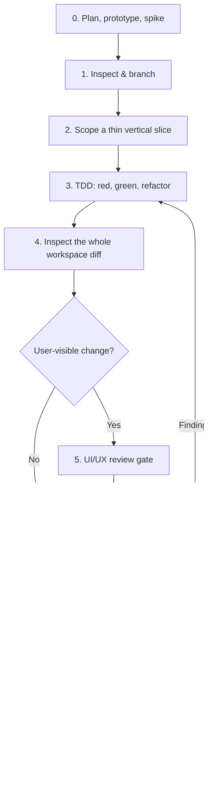

# Agent Guide — Cakebrew

Cakebrew is a native macOS GUI for Homebrew (Objective-C / AppKit).

**This file is the single source of truth** for how work happens in this repo —
conventions, architecture decisions, and the delivery workflow. It is written
for coding agents and human contributors alike. `CLAUDE.md` is a pointer to it.
`CONTRIBUTING.md` is a short human-facing entry point that links here rather
than restating anything. Do not add a second workflow, roadmap, or status
document: issues are the live status, and a second instruction file drifts.

Follow this exactly; it encodes decisions the maintainer has already made, and
measurements that cost real time to obtain.

---

## The workflow



### Phase 0 — Discovery

**Spike before you commit to a design.** Build throwaway prototypes to test
framework assumptions and find the edge cases, especially at integration
boundaries — never assume a third-party API behaves as documented. Two examples
from this repo's history: the App Sandbox question was settled by measuring
what actually broke, and layered app-icon support was settled by feeding
`actool` a probe entry and reading the warning. Both answers were the opposite
of the documentation-level guess.

Weigh alternatives on architectural fit, complexity, performance and
maintenance burden. Then break the design into an ordered list of thin vertical
slices, and **throw the prototype away** — production code is rebuilt under
TDD, not promoted from a spike.

### Phase 1 — Context and scoping

**Inspect before mutating.** Read the repo state, branches, and working tree
first. Preserve unrelated staged, unstaged and untracked changes — this machine
routinely carries modifications under `.claude/`, `.codex/` and `.entire/` that
are not yours to commit or discard. Stash them around a rebase; never
`git checkout --` a file you did not write.

**Branch off latest `main`.** Prefixes: `feat/`, `fix/`, `refactor/`, `docs/`,
`chore/`, `test/`, `perf/`. Never commit to `main` directly.

**Take one thin vertical slice** — the smallest cohesive end-to-end outcome
that can be tested, reviewed and shipped on its own. One PR per logical unit of
work; unrelated changes go on their own branch. A horizontal layer spanning the
whole app is not a slice.

### Phase 2 — Test-driven implementation

**Red → green → refactor, and the red is not optional.** Write the smallest
failing test first and confirm it fails *for the expected reason* — a compile
error on a not-yet-existing API counts, a crash in the runner does not. Then
the minimum code to pass. Then clean up with the suite green.

The test and the code that satisfies it land in the **same commit**, and the
commit message names what the test covers. Every behaviour change ships with a
test written first: bugs, features, behaviour-changing refactors. Only pure
formatting and documentation are exempt.

If you write the test and the implementation together and never observe the
red, you have not done TDD — **prove the test bites** by mutation instead:
break the implementation deliberately, confirm the suite fails, and restore it.
Say which of the two you did in the PR.

**Then inspect the whole workspace diff**, including untracked files
(`git status --untracked-files=all`). Remove scratch files, probes and
debugging artifacts. Temporary instrumentation must not reach a commit.

### Phase 3 — Quality gates

Run these in order. **If any gate causes a code change, restart from the
verification gate** — a fix invalidates every result that came before it.

**UI/UX review** *(only if a user-facing surface changed)*. Verify it visually:
launch the mock build (`-BPMockBrew`), look at it, confirm layout, dark mode,
and badges. For behaviour rather than looks, add a `CakebrewUITests` journey —
an assertion beats eyeballing a screenshot. Check accessibility and platform
idioms, not just that it renders.

**Verification.** Build **Debug and Release**, both warning-free — a new
warning is a failure. Run the full unit suite. Compile the UI test target.
Run the UI journeys before opening the PR.

**Code review** over the full branch diff plus anything uncommitted. Language
idioms, memory and concurrency safety, performance, architecture, edge cases.
Fix what you find, then re-verify.

### Phase 4 — Integration and delivery

**Conventional Commits.** `<type>(<scope>): <imperative summary>`, where type
is one of `feat` `fix` `refactor` `docs` `chore` `test` `perf` `build` `ci`
and scope names the area (`sidebar`, `reload`, `toolbar`, `brewfile`, `l10n`,
…). The body explains *why*, and names what the test covers. History before
this convention was adopted is left alone; do not rewrite it.

**Open a PR with the `gh` CLI**, never the web UI, and never a draft unless
asked. Describe what changed, why, and how it was tested — including what you
could *not* verify and the reason.

**Green CI is the merge gate.** Both jobs (Build & Test, UI Tests) must pass.
Never merge on pending or failing checks. If a UI test fails on CI, read the
failure and the `CAKEBREW_UI_TREE_*` dump in the job log before assuming a
flake — re-run once only when the evidence says infrastructure. If a reviewer
is assigned, wait for approval; never bypass an assigned review.

**Merge and clean up:** `gh pr merge <n> --squash --delete-branch` (squash is
the maintainer's explicit choice, and keeps history linear and bisectable),
then `git checkout main`, `git pull --ff-only`.

> **Stacked PRs:** retarget a child branch's base to `main` *before* merging its
> parent. Deleting a merged branch auto-closes any PR still based on it, and
> GitHub will not reopen a PR whose base is gone.

---

## Principles for agents working here

**Prototypes are disposable.** Spike code exists to answer a question. Once
answered, delete it and rebuild under TDD. Do not promote a spike.

**Separate the roles.** Planner, implementer, UI reviewer, verifier and code
reviewer are different jobs with different biases. One prompt wearing all five
hats reviews its own work and finds it good. Use separate agents or separate
passes, and give the reviewer the diff rather than the intent.

**Validate the instrument before believing its silence.** A probe that prints
nothing has not proven anything — it may not have run, may have hit a stale
binary, or may have been filtered out. Confirm the probe executed and observed
what you think it did. Concretely, in this repo: `xcodebuild analyze` exits 0
even with findings; `xcodebuild -scheme Cakebrew` never compiles the UI test
target; `xcodebuild test` output has to be *grepped for the assertion*, not
just for `TEST SUCCEEDED`; and a `log show` predicate that matches nothing
looks exactly like a feature that did not fire.

**Isolate shared state when working in parallel.** Agents on one machine
contend for real singletons: the Xcode derived-data directory, the app's
`NSUserDefaults` domain, `/Applications/Cakebrew.app`, the running app itself,
and the display. Never mutate sources in a workspace while a verification or
review pass is running against it; use a git worktree instead.

**One source of truth.** This file. Pointer files may reference it; nothing may
restate it.

---

## Build & test commands

```sh
# App build, both configurations — both must be warning-free
xcodebuild build -workspace Cakebrew.xcworkspace -scheme Cakebrew \
  -configuration Debug -destination 'platform=macOS' CODE_SIGNING_ALLOWED=NO

xcodebuild build -workspace Cakebrew.xcworkspace -scheme Cakebrew \
  -configuration Release -destination 'platform=macOS' CODE_SIGNING_ALLOWED=NO

# Unit tests (fast, hermetic — run these locally every time)
xcodebuild test -workspace Cakebrew.xcworkspace -scheme CakebrewTests \
  -destination 'platform=macOS' CODE_SIGNING_ALLOWED=NO

# UI tests (own scheme; needs ad-hoc signing; on CI this is authoritative)
xcodebuild test -scheme CakebrewUITests -destination 'platform=macOS' \
  CODE_SIGN_IDENTITY="-" CODE_SIGN_STYLE=Manual CODE_SIGNING_REQUIRED=NO \
  CODE_SIGNING_ALLOWED=YES DEVELOPMENT_TEAM="" PROVISIONING_PROFILE_SPECIFIER=""
```

After touching `CakebrewUITests.m`, compile that target — neither command above
does, so a syntax error there passes locally and fails on CI:

```sh
xcodebuild build-for-testing -scheme CakebrewUITests -destination 'platform=macOS' \
  CODE_SIGN_IDENTITY="-" CODE_SIGN_STYLE=Manual CODE_SIGNING_REQUIRED=NO \
  CODE_SIGNING_ALLOWED=YES DEVELOPMENT_TEAM="" PROVISIONING_PROFILE_SPECIFIER=""
```

CI (`.github/workflows/ci.yml`) runs both jobs on `macos-26` (latest SDK),
builds Debug and Release, runs the static analyzer, and uploads crash logs from
`~/Library/Logs/DiagnosticReports` on failure. A separate weekly
`brew-compat.yml` pushes the runner's *real* brew output through the parsers,
because fixture tests cannot notice upstream drift.

## Testing architecture

- **Mock brew:** launching the app with `-BPMockBrew` swaps
  `BPHomebrewInterface` for `BPMockHomebrewInterface` (resolved in
  `+sharedInterface`). The mock serves deterministic fixtures (`mockwget`,
  `mockgit` [pinned], `mockchrome`/`mockvscode` [casks], …) and stubs every
  operation as a no-op. **Any new interface method must get a mock override**
  so UI tests never shell out to real brew — `BPMockFidelityTests` fails if a
  mutating selector lacks one. Opt-in launch flags shape it for a specific
  journey: `-BPMockEmptyOutdated`, `-BPMockEmptyCleanup`, and
  `-BPMockSlowCatalog` (holds the catalog calls so progress and cancel are
  observable; the mock is otherwise instant, which makes both unobservable).
- **Unit tests** (`CakebrewTests/`) cover parsers, model logic, and manager
  state. The `BPHomebrewInterfaceListCall*` parsers are the standard TDD seam:
  pure input → `BPFormula` output. Private classes are re-declared in the test
  file to reach them.
- **UI tests** (`CakebrewUITests/`) are journey tests against the mock. The
  shared launch helper waits for the initial load to settle (mockwget rendered)
  before navigating — do not remove that; it closes a reselect race in
  `homebrewManagerFinishedUpdating:`. Sidebar item *names* repeat across groups
  (two "Installed", two "Outdated"), so journeys address rows by their stable
  unlocalized identifier — `[self sidebarRow:@"sidebar.casks.installed"]` —
  never by index. Match table cells with `value BEGINSWITH` (pinned rows carry
  a pin glyph after the name).
- **CI environment limits:** the headless runner's window is never key, so
  typing/keyboard focus is untestable; system file panels (NSSave/NSOpenPanel)
  are out-of-process and undrivable. Pattern: unit-test the logic, UI-test
  presence/navigation.
- **Five ways a green local UI run lies.** Each of these has cost a red CI run
  or a misdiagnosed failure:
  1. **`isHittable` is meaningless on CI.** Hit testing needs a key window, so
     it reports `false` there whatever is on screen. Assert with `exists` and
     geometry (`frame.size`) instead.
  2. **Anything persisted that changes the launch view makes the suite
     order-dependent.** Each journey would inherit whatever the last one left
     stored. Pin it in the shared launch helper through the argument domain,
     which outranks stored defaults — `-BPLastSelectedSidebarRow 1`,
     `-BPSortColumnIdentifier ""` — never by special-casing `-BPMockBrew` in
     the app, so the feature itself stays exercised.
  3. **Neither verify command compiles the UI test target.** `-scheme Cakebrew`
     and `-scheme CakebrewTests` both skip `CakebrewUITests.m`, so a syntax
     error there passes locally and fails on CI. After touching it, run
     `xcodebuild build-for-testing -scheme CakebrewUITests …` — about two
     seconds, versus ~7 minutes for the suite.
  4. **An alert's buttons are mirrored to the Touch Bar.** `self.app.buttons[@"Yes"]`
     therefore matches twice, and `firstMatch` can resolve to the mirror, which
     is not clickable ("cannot be called with Touch Bar elements"). Scope to the
     sheet: `self.app.sheets.firstMatch.buttons[@"Yes"]`. Note that
     `waitForExistenceWithTimeout:` tolerates a multi-match query, so an
     existing assertion passing is not evidence that clicking will work.
  5. **A locked screen breaks the suite in ways that look like product bugs.**
     XCUITest cannot drive a locked display: clicks resolve to infinite points
     and elements never become interactable. Before believing a UI failure that
     appeared without a related change, check
     `ioreg -n Root -d 1 -r -k IOConsoleLocked`; `screencapture` failing with
     "could not create image from window" is the same signal. A ~7 minute run
     can also be killed part-way by display sleep.

## Architecture crib sheet

- `BPHomebrewInterface` — all brew execution funnels through
  `performBrewCommandWithArguments:dataReturnBlock:` (async, streams) or
  `performSyncBrewCommandWithArguments:`. Output blocks may be nil — always
  guard (`invokeOutputBlock:withString:`), passing nil is legitimate.
- **List pattern:** a `BPListMode` enum case → a `BPHomebrewInterfaceListCall`
  subclass (arguments + line parser) → a `BPHomebrewManager` property fetched
  in `reloadFromInterfaceRebuildingCache:` → a sidebar item + badge → a mock
  fixture. Follow this groove for any new list.
- **Casks** are `BPFormula` instances with `cask == YES` (set by the cask list
  parsers; survives copy/coding). Operations dispatch on that flag in
  `BPInstallationWindowController` (`--cask` variants). `statusForFormula:` is
  namespace-aware — casks read only the cask lists.
- **Slow catalogs** (`brew formulae`, `brew casks`) share a 24h disk cache
  (`allFormulae.cache.bin`, two keys). `brew casks` can take 80+ s cold.
- **Sidebar:** `FormulaeSideBarItem` enum values are **outline row indices**
  (groups included). Inserting a row renumbers everything after it — update
  the enum, the View-menu item tags in `MainMenu.xib`, and check every
  `switch`/comparison on the enum (`grep -rn FormulaeSideBarItem`).
- **Never `reloadData` the sidebar to refresh a badge.** Reloading an
  `NSOutlineView` clears its selection, and `-configureSidebarSettings` restores
  the user's last row at setup — so a stray reload silently drops it, and the
  next `sourceListSelectionDidChange` persists whatever replaced it. Use
  `-refreshBadgeForListMode:`, which redraws one row with `reloadItem:`. The
  old all-at-once reload got away with it only because it ran inside
  `-homebrewManagerFinishedUpdating:`, which reselects immediately afterwards.
- **Row identity for VoiceOver and XCUITest lives on the cell's text field**,
  not the `NSTableCellView` — the container is not an accessibility element, so
  an identifier set there reaches neither. Rows carry unlocalized identifiers
  (`sidebar.casks.installed`); journeys address rows by those, never by index.

## UI conventions

- **Sheets, not app-modal:** every alert/confirmation uses
  `beginSheetModalForWindow:_appDelegate.window …` — never `runModal` (blocks
  the app and is invisible to XCUITest). Attach to `_appDelegate.window`, NOT
  `self.view.window` (nil under the split-view reparenting; caused a crash).
- **Xibs are edited as XML by hand.** After editing: `xmllint --noout` the
  file, keep new `id`s unique (prefix `cbk-…`), and grow an `NSStackView`'s
  `visibilityPriorities`/`customSpacing` arrays when adding arranged subviews.
  Menu items enable via Cocoa **bindings** on `currentFormula` /
  `currentFormulaPinned` (see existing items), not `validateMenuItem:`.
- **Localization:** UI strings go in all six `Cakebrew/*.lproj/
  Localizable.strings` files (lint with `plutil -lint`). New strings use the
  English text in every locale until translated. Homebrew terms ("Casks") stay
  untranslated. Xib menu titles are Base-internationalized literals — no
  `.strings` churn for new menu items.
- Icons are SF Symbols (`imageWithSystemSymbolName:`); no bundled image assets
  for UI chrome.

## Distribution & sandboxing

Cakebrew ships **Developer ID + hardened runtime + notarized**, and is
**not** App-Sandboxed. `.github/workflows/release.yml` does the signing,
notarization and stapling on a `v*` tag (see its header for the required
secrets).

The sandbox question was settled by measurement, not assumption — repeat these
if you revisit it:

| Configuration | Result |
|---|---|
| Plain `com.apple.security.app-sandbox` | `brew` cannot even be executed: `zsh:1: operation not permitted: brew` |
| Sandbox + `temporary-exception.files.absolute-path.read-write` for the prefix | `brew --version` / `brew list` **work**; `/usr/local/Cellar`, `/usr/local/Caskroom`, `/Applications` are writable |
| …but the home directory is redirected | `$HOME` becomes `~/Library/Containers/<id>/Data`, so `~/Library/Caches/Homebrew` and `~/Library/LaunchAgents` resolve **inside the container** |

That last row is the blocker: brew's download cache would diverge from the
user's real one (re-downloading, and disagreeing with `brew` in Terminal), and
**`brew services` writes LaunchAgents to `~/Library/LaunchAgents`** — under the
sandbox those land in the container where `launchd` never sees them, silently
breaking the Services feature. Temporary-exception entitlements are also an
App-Store-review mechanism (routinely rejected, and they hardcode a prefix that
differs between `/usr/local` and `/opt/homebrew`), so they buy nothing for
Developer ID distribution.

**Therefore:** don't add `com.apple.security.app-sandbox`. Hardened runtime,
no ATS weakening, a privacy manifest, and validated user input are the
hardening this app can actually carry.

## Signed local builds (helper testing)

Day-to-day development needs nothing special: an Xcode build (Cmd-R) is signed
with your Apple Development certificate, and that **already satisfies the
helper's designated requirement** (it pins `anchor apple generic` plus the team
OU, which development certs carry). So the debug build can drive the helper.

To exercise helper registration and Login Items approval for real, the app has
to be signed and living in `/Applications`:

```sh
scripts/install-signed.sh          # Release, or pass Debug
```

It builds into a temporary derived-data dir (so it can't leave a stale
unsigned helper in your normal one), verifies both signatures, replaces
`/Applications/Cakebrew.app`, and prints the next steps.

A final build phase, **Verify embedded helper signature**, fails the build if
the embedded helper wouldn't satisfy the app's requirement — otherwise the app
silently refuses to talk to its own helper at runtime. It skips automatically
for unsigned/ad-hoc builds (CI), and declares the helper as a script input
because Xcode sandboxes script phases.

**Distribution certificates:** notarized releases need a *Developer ID
Application* certificate, which is separate from Apple Development. Until one
exists in the account, `.github/workflows/release.yml` cannot run.

## OS support policy

Minimum deployment target = **latest macOS minus one** (currently 15.0);
build and CI against the **latest SDK** (`SDKROOT = macosx`, never pinned;
CI runner tracks the newest image, currently `macos-26`). When a new major
macOS ships: bump the deployment target one, bump the CI runner, never pin
`SDKROOT`. `LSMinimumSystemVersion` derives from the build setting.

## Known environment quirks (primary dev machine)

- **`git push` hangs** on the Entire pre-push hook (session-log sync). Push
  with `git push --no-verify` — it skips only that hook, nothing code-related.
- **Local XCUITest works** (since 2026-08-15). It used to die at init with
  "Timed out while enabling automation mode"; the cause was macOS developer
  mode being off, fixed once with `sudo DevToolsSecurity -enable`. Being in the
  `_developer` group is not sufficient on its own, and Accessibility permission
  is *not* required. If that init timeout ever returns, check
  `DevToolsSecurity -status` first. The full local run takes ~6 minutes (vs ~4s
  for the unit suite), so it is a pre-PR step, not an inner-loop one. CI remains
  the merge gate.
- **A locked screen blocks the whole visual toolchain**, not just XCUITest:
  `screencapture` fails with "could not create image from window", and the UI
  suite fails with `Failed to activate application … (current state: Running
  Background)`. Check `ioreg -n Root -d 1 -r -k IOConsoleLocked` before
  believing either. There is no way around it from a shell — the work is a
  pre-PR step that needs the display awake.
- **You cannot force one app to light mode from the command line.**
  `-AppleInterfaceStyle Light` in the argument domain is ignored: AppKit reads
  the appearance from the system preference directly rather than through
  `NSUserDefaults` precedence, so the app comes up in whatever the system is.
  Capturing a light-mode screenshot means flipping System Settings ▸ Appearance
  by hand.
- Commit signing is temporarily disabled (`git -c commit.gpgsign=false`) while
  the 1Password SSH agent is broken. Re-enable when fixed.
