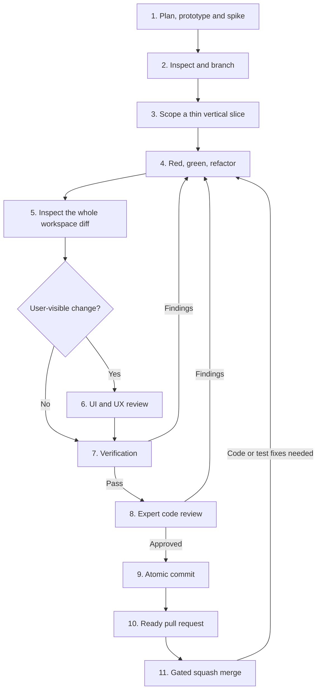

# Agent Guide — Cakebrew

Cakebrew is a native macOS GUI for Homebrew, written in Objective-C / AppKit.
This file is the sole authority for workflow, conventions and architecture.
`CLAUDE.md` and `CONTRIBUTING.md` are pointers; skills and custom agents are
routing adapters, not independent policy. Update rules here first. Keep live
status and roadmaps in issues, not additional instruction or status documents.

## Engineering workflow



### Discovery and scoping — steps 1–3

1. **Plan and measure before committing to a design.** Inspect relevant code,
   integration boundaries and tests. Test uncertain framework/API behavior,
   feasibility, edge cases and performance with the smallest disposable spike.
   Compare architectural fit, complexity, performance and maintenance burden;
   produce ordered, independently shippable slices. Discard your spike and
   scratch artifacts before production implementation; rebuild under TDD
   rather than promoting prototype code.
2. **Inspect before any mutation, including a spike.** Check repository state,
   branches, worktrees and relevant configuration. Preserve unrelated staged,
   unstaged and untracked files, especially `.claude/`, `.codex/` and `.entire/`.
   Do not discard another person's work to obtain a clean tree. Isolate it or
   stash and restore it when necessary for a rebase. Branch from latest `main`
   using `feat/`, `fix/`, `refactor/`, `docs/`, `chore/`, `test/` or `perf/`.
   Never commit directly to `main`.
3. **Select one thin vertical slice.** Define the smallest cohesive end-to-end
   outcome, acceptance criteria, exclusions, owned files and expected failing
   test. One logical unit per PR; unrelated changes need separate branches.
   A horizontal layer spanning the application is not a slice.

### Implementation — steps 4–5

4. **Red → green → refactor.** Write the smallest focused test first and
   observe failure for the expected reason. A compile error for a missing API
   counts; a runner crash does not. Implement only enough to pass, then
   refactor with the suite green. Every behavior change needs this evidence,
   including bugfixes and behavior-changing refactors. If red was missed,
   deliberately mutate the implementation, observe the expected test failure,
   and restore it. Report which method proved the test bites. Tests and the
   code satisfying them belong in the same commit. Only pure documentation
   and formatting are exempt from behavioral TDD.
5. **Inspect the complete workspace.** Review the branch diff, staged and
   unstaged changes, and `git status --untracked-files=all`. Remove only your
   scratch files, probes and temporary instrumentation. Preserve unrelated
   changes and exclude them from the slice.

### Quality gates — steps 6–8

Run these gates in order on stable sources. Reviewers receive the actual diff
and observed evidence, not just implementation intent. They report findings;
they do not fix their own findings.

6. **UI/UX review, when user-visible behavior or appearance changes.** A
   separate reviewer launches the mock build (`-BPMockBrew`) and checks layout,
   light/dark appearance, badges, accessibility and AppKit idioms. Behavior
   needs a `CakebrewUITests` journey, not screenshots alone. Report anything
   that could not be exercised; an environment limitation is not an approval.
7. **Verification.** Build Debug and Release warning-free, run the full unit
   suite and applicable integration checks, compile the UI test target, and
   run the full UI journeys before opening the PR. Inspect diagnostics and
   static-analysis results; every warning or failed check is a finding.
   Confirm tests actually executed against the intended source and binary.
   For instruction/documentation-only changes, use syntax, link and routing
   validation plus independent policy review; app builds do not validate prose.
   This exception does not cover executable code, tests or build/CI changes.
8. **Independent expert review.** Review the full branch diff and all
   uncommitted files after verification passes. Cover Objective-C idioms,
   memory and async safety, performance, architecture, edge cases, regressions
   and missing tests. Resolve every actionable finding before approval.

**Fix loop:** send findings to the implementer. After any code or test edit,
restart the entire verification sequence and obtain fresh expert approval;
repeat UI review when the fix changes a user-facing surface. No partial rerun
or prior approval substitutes for gates on the changed state. Updated policy
or instructions likewise need fresh applicable validation and review.

### Delivery — steps 9–11

The primary agent owns delivery. A user-assigned implementation or delivery
goal authorizes the in-scope lifecycle through commits, pushes, ready PRs,
gated squash merges and cleanup. Do not ask for renewed permission at each
stage or stop at an intermediate handoff when the goal remains unfinished.
An explicit limit such as "plan only", "review only", "do not push" or
"leave the PR open" overrides this default; questions and diagnosis alone
do not authorize implementation or delivery.

Continue through the goal's scoped slices, resolve in-scope findings and repeat
invalidated gates until its acceptance criteria and authorized delivery are
complete. Once current-head checks and assigned reviews pass, squash merge
without a second confirmation. Use the available wait/monitor mechanism for
pending external gates; pending CI alone is not a reason to hand the task back.
Keep the user informed without turning progress updates into approval prompts.
Goal authority does not expand scope, override execution permissions or permit
unrelated destructive actions, releases or host/account configuration changes.

9. **Atomic Conventional Commit.** Stage only the verified, reviewed slice.
   Use `<type>(<scope>): <imperative summary>` with type `feat`, `fix`,
   `refactor`, `docs`, `chore`, `test`, `perf`, `build` or `ci`. The body explains
   why and names the test coverage. Do not rewrite historical conventions.
10. **Ready PR using `gh`.** No web UI; no draft unless requested. Explain
    what changed, why, red-first or mutation evidence, verification results
    and any unverified behavior with its reason.
11. **Gated squash merge.** Except for the explicitly scoped temporary
    exception below, all required CI must be green, including both
    **Build & Test** and **UI Tests**, for the current PR head. Wait for every
    assigned human or automated review to approve and resolve actionable
    feedback. Never bypass pending, failing or requested-change gates.

During delivery, diagnose failures and route in-scope code/test fixes through
the fix loop; hold publication or merge until its gates pass. Stale evidence
requires revalidation, not abandonment of the task. Stop for missing authority,
credentials, required user interaction or scope expansion. Do not treat an
environment failure as a product defect or silently waive a gate.

Respect an explicit pause or resource constraint. If Actions is intentionally
disabled, keep it disabled until the user authorizes re-enabling it; continue
permitted local work and publication, but do not treat absent CI as green.
When required gates cannot run under that constraint, report the blocker and
remaining work rather than claiming completion or bypassing the merge gate,
unless the explicit temporary exception below applies.

**Temporary Actions-minutes exception (expires October 8, 2026).** The owner
authorized squash-merging PRs #166, #167, #169 and #170, plus the documentation
PR recording this exception, while Actions is disabled for exhausted minutes.
Only the absent hosted-CI gate is waived for that batch. Keep Actions disabled;
retain source-matched local verification, independent reviews and resolution
of actionable feedback. Record the exception and actual local evidence in
each PR; do not report missing CI as successful. This does not waive failing
checks or authorize later PRs without another explicit owner exception.
Track restoration in [issue #171](https://github.com/scottdensmore/Cakebrew/issues/171):
review available minutes on October 8, re-enable Actions when authorized and
remove this paragraph through a reviewed documentation PR. The exception
expires on that date even if restoration is delayed; otherwise it ends as
soon as Actions is re-enabled. Never change repository protections to apply it.

For a CI UI failure, read the assertion and `CAKEBREW_UI_TREE_*` dump in the
job log before calling it flaky. Rerun once only when evidence indicates
infrastructure; otherwise fix the cause through the workflow.

Before deleting a stacked PR's parent branch, retarget the child PR to `main`;
deletion otherwise auto-closes it. Recheck the child's diff and gates against
its new base. Merge with `gh pr merge <n> --squash --delete-branch`, then switch
to `main` and `git pull --ff-only`, preserving unrelated work and respecting
branches checked out in other worktrees.

## Role orchestration and evidence

For each feature, bugfix or behavior-changing refactor, the primary agent uses
`$cakebrew-workflow` and delegates to the configured roles below. Planning,
implementation and gates must not collapse into one self-review. If a custom
agent is unavailable, use a separate agent with its matching skill; disclose
any unavailable gate rather than claiming it passed.

| Role | Skill | Custom agent | Required handoff |
| --- | --- | --- | --- |
| Orchestrator | `$cakebrew-workflow` | Primary | Scope, decisions, role sequencing, authorized delivery |
| Planner | `$cakebrew-plan` | `cakebrew-planner` | Measured unknowns, alternatives, ordered slices, acceptance criteria, expected red, spike cleanup |
| Implementer | `$cakebrew-implement` | `cakebrew-implementer` | Owned diff, red/green or mutation evidence, remaining risks |
| UI reviewer | `$cakebrew-ui-review` | `cakebrew-ui-reviewer` | Observed visual/journey evidence; approval, findings or blocker |
| Verifier | `$cakebrew-verify` | `cakebrew-verifier` | Commands, diagnostics, test counts/skips, artifacts; pass, fail or blocker |
| Code reviewer | `$cakebrew-code-review` | `cakebrew-code-reviewer` | Approval or actionable findings with severity, file/line, impact and evidence |
| Delivery | `$cakebrew-deliver` | Primary | Commit/PR/head identity, CI and assigned-review status, merge/cleanup result |

Give each assignment its worktree, base/head and uncommitted diff, acceptance
criteria, explicit file ownership, evidence locations and exclusions. Tell
mutating agents they are not alone and must preserve others' edits. Subagents
may not expand scope, edit project policy or perform delivery unless those
actions are explicitly their assignment. Gate agents never edit sources.

Handoffs must identify the state examined: worktree, base/head and relevant
uncommitted file state. Include concise observed results and log/artifact paths,
not raw log floods. A result for another tree or stale binary is not evidence.

**Parallel work is encouraged:** the primary agent should delegate independent
slices, investigations and gate passes concurrently when useful. Identify
dependencies first; do not wait for one independent slice to finish before
starting another. Preserve lifecycle order within each slice, and integrate
dependent slices in order. The primary agent coordinates shared resources,
collects every handoff and owns delivery; parallelism does not allow self-review.

**Safe concurrency:** use isolated worktrees for independent mutating work.
Never change sources while a verifier or reviewer examines that workspace.
Separate derived-data directories do not isolate the app's `NSUserDefaults`,
catalog cache, running process, `/Applications/Cakebrew.app` or display.
Serialize UI/runtime work unless those resources are safely isolated. Preserve
and restore user state; do not replace the installed app as incidental testing.

## Build and test commands

Use a separate `-derivedDataPath` per concurrent build/worktree. Select the
intended architecture explicitly if Xcode reports ambiguous destinations.
Run the following sequence for executable changes:

```sh
xcodebuild build -workspace Cakebrew.xcworkspace -scheme Cakebrew \
  -configuration Debug -destination 'platform=macOS' CODE_SIGNING_ALLOWED=NO

xcodebuild build -workspace Cakebrew.xcworkspace -scheme Cakebrew \
  -configuration Release -destination 'platform=macOS' CODE_SIGNING_ALLOWED=NO

xcodebuild test -workspace Cakebrew.xcworkspace -scheme CakebrewTests \
  -destination 'platform=macOS' CODE_SIGNING_ALLOWED=NO

xcodebuild build-for-testing -scheme CakebrewUITests -destination 'platform=macOS' \
  CODE_SIGN_IDENTITY="-" CODE_SIGN_STYLE=Manual CODE_SIGNING_REQUIRED=NO \
  CODE_SIGNING_ALLOWED=YES DEVELOPMENT_TEAM="" PROVISIONING_PROFILE_SPECIFIER=""

xcodebuild test -scheme CakebrewUITests -destination 'platform=macOS' \
  CODE_SIGN_IDENTITY="-" CODE_SIGN_STYLE=Manual CODE_SIGNING_REQUIRED=NO \
  CODE_SIGNING_ALLOWED=YES DEVELOPMENT_TEAM="" PROVISIONING_PROFILE_SPECIFIER=""
```

**Validate the instrument:** the app and unit schemes do not compile
`CakebrewUITests.m`. After editing it, compile its own target even during the
inner loop. Inspect actual assertions, executed test counts and skips, not
only `TEST SUCCEEDED`. `xcodebuild analyze` can exit zero with findings; read
the diagnostics. An empty `log show` result proves nothing unless the probe
ran and the predicate captured the intended event.

CI (`.github/workflows/ci.yml`) builds both configurations, runs static
analysis and both test jobs on `macos-26`, and uploads diagnostic crash logs
on failure. Weekly `brew-compat.yml` exercises parsers against real Homebrew
output; fixtures alone cannot detect upstream drift.

## Testing contracts

- **Mock boundary:** `-BPMockBrew` resolves `+sharedInterface` to
  `BPMockHomebrewInterface`. Fixtures include `mockwget`, pinned `mockgit`,
  `mockchrome` and `mockvscode`; operations are no-ops. Every new interface
  method needs a mock override so UI tests never run real brew.
  `BPMockFidelityTests` guards mutating selectors. Use `-BPMockEmptyOutdated`,
  `-BPMockEmptyCleanup` and `-BPMockSlowCatalog` for their respective journeys;
  the slow catalog makes progress and cancellation observable.
- **Unit seams:** `CakebrewTests/` covers parsers, models and manager state.
  `BPHomebrewInterfaceListCall*` provides pure input → `BPFormula` tests;
  private classes can be re-declared in tests.
- **Deterministic journeys:** the shared UI launch helper waits for the
  initial load (`mockwget`) before navigation to avoid the manager's reselect
  race. Pin persisted launch-view settings in its argument domain, including
  `-BPLastSelectedSidebarRow 1` and `-BPSortColumnIdentifier ""`; do not bypass
  persistence in application code just because `-BPMockBrew` is present.
- **Stable identity:** sidebar names repeat across groups. Use unlocalized
  identifiers such as `sidebar.casks.installed`, not row indices or titles.
  Match table cells with `value BEGINSWITH` because pinned rows append a glyph.
- **Headless CI:** windows are not key, so typing/focus and `isHittable` are
  unreliable. Assert `exists` and geometry (`frame.size`). System file panels
  are out-of-process: unit-test their logic and UI-test presence/navigation.
- **Sheet buttons:** scope actions to `self.app.sheets.firstMatch.buttons`
  to exclude Touch Bar mirrors. `waitForExistenceWithTimeout:` accepting a
  multi-match query does not prove the intended button can be clicked.

## Architecture and UI conventions

- `BPHomebrewInterface` funnels brew execution through
  `performBrewCommandWithArguments:dataReturnBlock:` (async/streaming) or
  `performSyncBrewCommandWithArguments:`. Output blocks may legitimately be
  nil; guard them with `invokeOutputBlock:withString:`.
- New lists follow: `BPListMode` → `BPHomebrewInterfaceListCall` subclass
  (arguments/parser) → manager property in `reloadFromInterfaceRebuildingCache:`
  → sidebar item/badge → mock fixture.
- Casks are `BPFormula` objects with `cask == YES`, preserved by copying and
  coding. `BPInstallationWindowController` dispatches `--cask` operations;
  `statusForFormula:` reads only the matching namespace's lists.
- Slow `brew formulae` and `brew casks` catalogs share a 24-hour disk cache
  (`allFormulae.cache.bin`, two keys). Avoid unnecessary cold catalog calls.
- `FormulaeSideBarItem` values are outline row indices, including groups.
  Insertions require updating the enum, View-menu tags in `MainMenu.xib` and
  every switch/comparison (locate with `rg FormulaeSideBarItem`).
- Refresh badges with `refreshBadgeForListMode:` / `reloadItem:`, never sidebar
  `reloadData`: it clears selection and can persist an unintended row.
  Accessibility row identifiers belong on the cell's text field, not the
  non-accessible `NSTableCellView` container.
- Use `beginSheetModalForWindow:_appDelegate.window …`, never `runModal` or
  `self.view.window` (which can be nil during split-view reparenting).
- Edit xibs as XML; run `xmllint --noout`, use unique `cbk-…` IDs and extend
  `NSStackView` visibility-priority/custom-spacing arrays with arranged views.
  Menu enablement uses Cocoa bindings (`currentFormula` / `currentFormulaPinned`),
  not `validateMenuItem:`.
- Add UI strings to all six `Cakebrew/*.lproj/Localizable.strings` files and
  run `plutil -lint`. Use English placeholders until translated; keep Homebrew
  terms such as "Casks" untranslated. Base-internationalized xib menu titles
  do not need `.strings` churn. Use SF Symbols for UI chrome, not bundled icons.
  Translation debt is reported by `ruby scripts/localization-debt.rb` in CI
  logs and the job summary; classifications live in
  `scripts/localization-debt.json`. Keep uncertain English matches unreviewed
  rather than labeling them as confirmed placeholders. Debt counts are
  informational; malformed input or invalid classification metadata is an error.

## Distribution and platform constraints

- Ship Developer ID signed, hardened and notarized, **without App Sandbox**.
  Keep the privacy manifest, input validation and ATS protections. Sandbox
  probes showed brew execution needs filesystem exceptions; even with them,
  the redirected home directory splits Homebrew caches and sends Services
  LaunchAgents into a container where launchd cannot use them. Do not add
  `com.apple.security.app-sandbox`; remeasure these boundaries before revisiting.
- `.github/workflows/release.yml` signs, notarizes and staples on `v*` tags;
  its header lists required secrets. Releases need a Developer ID Application
  certificate, separate from Apple Development; verify availability before
  attempting distribution.
- Ordinary Apple Development-signed Xcode builds satisfy the helper's team-OU
  designated requirement. Real registration/Login Items testing requires a
  signed app in `/Applications`. With authorization to replace the installed
  app, use `scripts/install-signed.sh` (Release by default, or pass `Debug`):
  it uses fresh derived data and verifies both signatures. Keep the final
  **Verify embedded helper signature** build phase and its declared input;
  it skips unsigned/ad-hoc builds intentionally.
- Minimum macOS is latest major minus one (current project target: `15.0`).
  Use the latest SDK (`SDKROOT = macosx`, never pinned) and latest CI runner
  (currently `macos-26`). At a new major release, update the minimum and runner;
  `LSMinimumSystemVersion` derives from the build setting.

## Local environment diagnostics

- Entire's session-sync pre-push hook hangs on this machine. Use
  `git push --no-verify` for that known hook issue, not to bypass code checks.
- For "Timed out while enabling automation mode", check
  `DevToolsSecurity -status` first. Developer mode, not just `_developer` group
  membership, was the local prerequisite; do not change host permissions
  based on an unexplained runner failure. Full UI runs take minutes and belong
  before PR creation, not in the TDD inner loop.
- Check `ioreg -n Root -d 1 -r -k IOConsoleLocked` before visual testing.
  A locked/sleeping display can cause infinite click coordinates, background
  activation failures or `screencapture` errors. Ask for the display to be
  unlocked/awake; those are not product failures and cannot be fixed in code.
- `-AppleInterfaceStyle Light` does not reliably force AppKit appearance.
  Check the rendered appearance; coordinate a manual System Settings change
  when needed rather than silently changing the user's global preferences.
- While the 1Password SSH signing agent remains broken, use
  `git -c commit.gpgsign=false` for commits. Re-enable signing when fixed.
