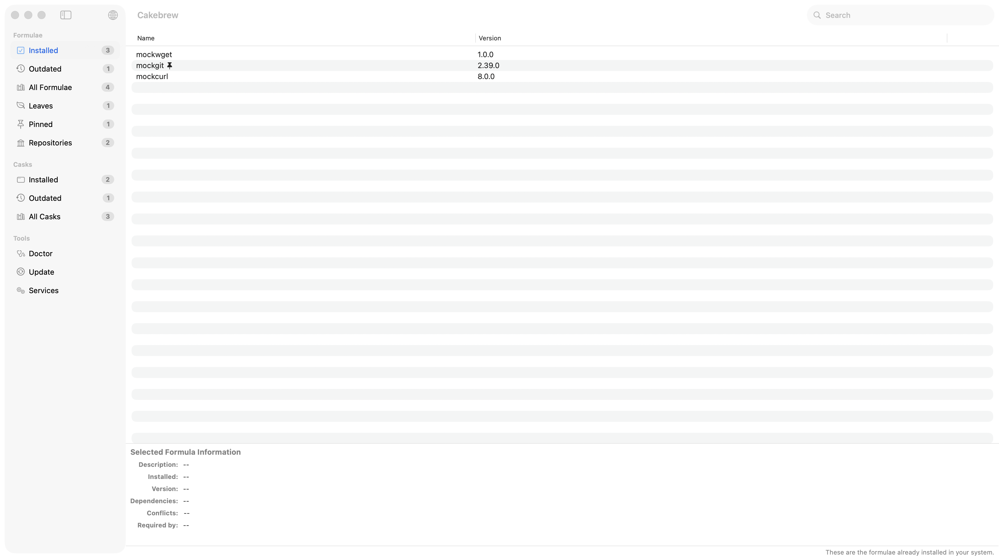
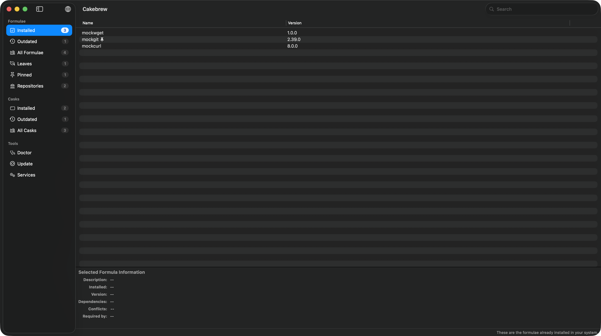

# Cakebrew

A native macOS app for [Homebrew](https://brew.sh).

[](https://github.com/scottdensmore/Cakebrew/actions/workflows/ci.yml)

Cakebrew gives Homebrew a Mac interface: browse what is installed, see what is
out of date, install and remove packages, and manage the services brew runs in
the background — without remembering a command for each of them.

| Light | Dark |
|---|---|
|  |  |

## What it does

**Formulae**
* Browse installed, outdated, leaves, pinned and the full catalog
* Install, uninstall and upgrade, individually or everything at once
* Pin a formula to hold it at its installed version, with a badge in the list
* Read a formula's description, version, dependencies, conflicts and dependents

**Casks**
* Browse installed, outdated and all available casks
* Install, uninstall and upgrade, optionally running a cask's `zap` stanza to
  remove its preferences and support files too

**Tools**
* Services — start, stop and restart the background services brew manages
* Doctor — run `brew doctor` and read its report
* Update — run `brew update`
* Cleanup — reclaim disk space
* Import and export a Brewfile

**Around the edges**
* Optional background checking, with a Dock badge and a notification when
  something new goes out of date
* Search across formulae and casks
* Six localizations: English, German, French, Italian, Portuguese and
  Simplified Chinese

## Requirements

macOS 15 or later. Homebrew must already be installed — Cakebrew drives the
`brew` you have, it does not bundle its own.

Works with both Homebrew prefixes (`/usr/local` on Intel, `/opt/homebrew` on
Apple silicon).

## Installing

Download the latest build from
[Releases](https://github.com/scottdensmore/Cakebrew/releases). Builds are
signed with a Developer ID certificate, notarized and stapled, so they open
without a Gatekeeper warning.

## Building

```sh
git clone https://github.com/scottdensmore/Cakebrew.git
cd Cakebrew
open Cakebrew.xcworkspace
```

Or from the command line:

```sh
# Build (must be warning-free)
xcodebuild build -workspace Cakebrew.xcworkspace -scheme Cakebrew \
  -configuration Debug -destination 'platform=macOS' CODE_SIGNING_ALLOWED=NO

# Unit tests — fast and hermetic
xcodebuild test -workspace Cakebrew.xcworkspace -scheme CakebrewTests \
  -destination 'platform=macOS' CODE_SIGNING_ALLOWED=NO

# UI tests — journeys against a mock brew, no real Homebrew involved
xcodebuild test -scheme CakebrewUITests -destination 'platform=macOS' \
  CODE_SIGN_IDENTITY="-" CODE_SIGN_STYLE=Manual CODE_SIGNING_REQUIRED=NO \
  CODE_SIGNING_ALLOWED=YES DEVELOPMENT_TEAM="" PROVISIONING_PROFILE_SPECIFIER=""
```

Launching with `-BPMockBrew` swaps in a fixture-backed interface, so you can
drive the whole UI without touching a real Homebrew installation. That build is
Debug-only.

## Contributing

See [CONTRIBUTING.md](CONTRIBUTING.md) for the workflow, and
[AGENTS.md](AGENTS.md) for the full working agreement — it is written for both
human contributors and coding agents, and it is the authoritative version.

## Security

Cakebrew ships a privileged helper. Please report vulnerabilities privately
rather than in a public issue — see [SECURITY.md](SECURITY.md).

## Credits

Cakebrew was created by [Bruno Philipe](https://github.com/brunophilipe), based
on a project by [vincentsaluzzo](https://github.com/vincentsaluzzo/Homebrew-GUI)
whose commits are still in the working tree. This repository is a fork
maintained by [Scott Densmore](https://github.com/scottdensmore).

Distributed under the GNU General Public License version 3. See
[LICENSE](LICENSE).
